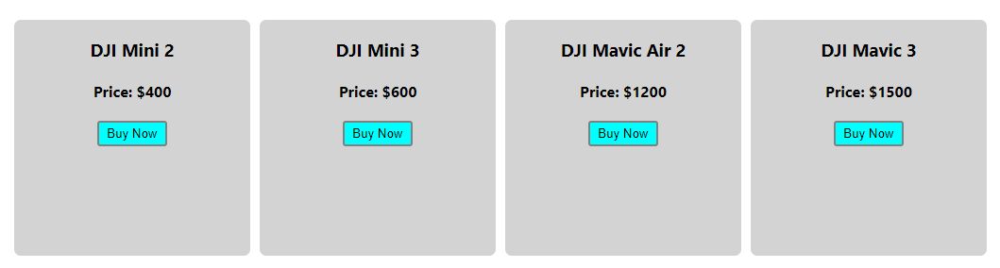

# 50 React Projects for Beginners from Easy to Hard.

| **Project No** | **Project Name**  |
|:-------:|:------------:|
|    [01](#01-hello-world-app)    | [Hello World App](#01-hello-world-app) |
|    [02](#02-simple-counter)    |   [Simple Counter](#02-simple-counter)           |
|    [03](#03-product-list-app)    |  [Product List App](#03-product-list-app)            |
|    04    |              |
|    05    |              |
|    06    |              |
|    07    |              |
|    08    |              |
|    09    |              |
|    10   |              |
|    11   |              |
|    12   |              |
|    13   |              |
|    14   |              |
|    15   |              |
|    16   |              |
|    17   |              |
|    18   |              |
|    19   |              |
|    20   |              |
|    21   |              |
|    22   |              |
|    23   |              |
|    24   |              |
|    25   |              |
|    26   |              |
|    27   |              |
|    28   |              |
|    29   |              |
|    30   |              |
|    31   |              |
|    32   |              |
|    33   |              |
|    34   |              |
|    35   |              |
|    36   |              |
|    37   |              |
|    38   |              |
|    39   |              |
|    40   |              |
|    41   |              |
|    42   |              |
|    43   |              |
|    44   |              |
|    45   |              |
|    46   |              |
|    47   |              |
|    48   |              |
|    49   |              |
|    50   |              |

# 01. Hello World App
### Difficulty: Easy (1/10)
### You Will Learn
- How to install node.
- How to setup React.
- Modifying **app.js** file.

### Project Description
A simple react project which prints **Hello World**.

### Project Screenshot

### Project Preview Link  
**<a href="https://csb-rwcjfk.vercel.app/" target="_blank">Project Preview</a>**

### Project Source Codes
**[Source Codes](01-hello-world-app/)**

### Video Explanation
Coming Soon...

## [Back to Top](#50-react-projects-for-beginners-from-easy-to-hard)

# 02. Simple Counter
### Difficulty: Easy (2/10)
### You Will Learn
- Basic Concept of Component.
- React State.
- Creating a Simple Counter Component.

### Project Description
A simple counter project which allows you to **increment**, **decrement** and **reset** a value by clicking the respective buttons.

### Project Screenshot

### Project Preview Link 
**<a href="https://csb-iwjv8e.vercel.app/" target="_blank">Project Preview</a>**

### Project Source Codes
**[Source Codes](./02-simple-counter/)**

### Video Explanation
Coming Soon...

## [Back to Top](#50-react-projects-for-beginners-from-easy-to-hard)

# 03. Product List App
### Difficulty: Easy (2/10)
### You Will Learn
- How to create and reuse components when needed.
- How to use same components to make similar types of contents (which is the react's one of the best features).

### Project Description
This tiny project belongs to a simple UI which shows a list of products. Each section of products looks similar, but different in data which invokes developers to use React in their app.

### Project Screenshot

### Project Preview Link 
**<a href="https://csb-y4dfon.vercel.app/" target="_blank">Project Preview</a>**

### Project Source Codes
**[Source Codes](./03-product-list-app/)**

### Video Explanation
Coming Soon...

## [Back to Top](#50-react-projects-for-beginners-from-easy-to-hard)
