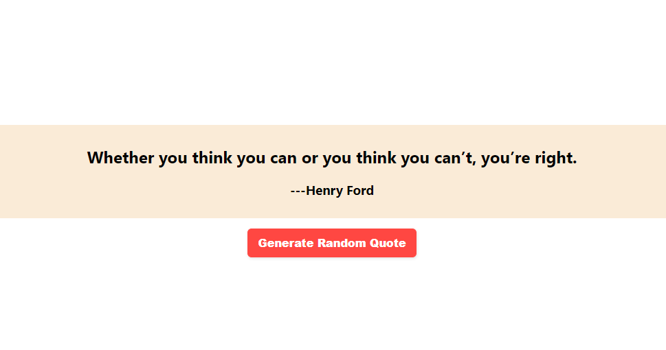
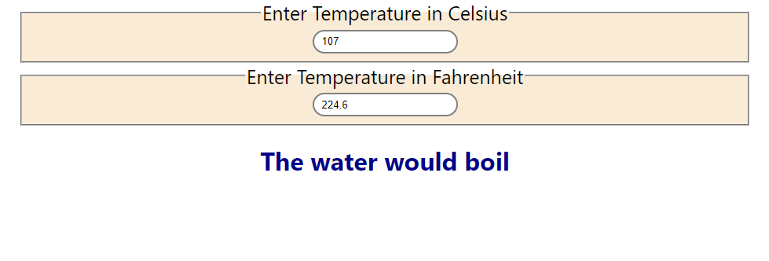

# 50 React Projects for Beginners from Easy to Hard.

|     **Project No.**      |            **Project Name**            |            **Live Project Link**            |
| :----------------------: | :------------------------------------: | :-----------------------------------------: |
| [1](#01-hello-world-app) | [Hello World App](#01-hello-world-app) | [Live Demo](https://csb-rwcjfk.vercel.app/) |
| [2](#02-simple-counter)  |  [Simple Counter](#02-simple-counter)  | [Live Demo](https://csb-iwjv8e.vercel.app/) |
|            3             |                                        |                                             |
|            4             |                                        |                                             |
|            5             |                                        |                                             |
|            6             |                                        |                                             |
|            7             |                                        |                                             |
|            8             |                                        |                                             |
|            9             |                                        |                                             |
|            10            |                                        |                                             |
|            11            |                                        |                                             |
|            12            |                                        |                                             |
|            13            |                                        |                                             |
|            14            |                                        |                                             |
|            15            |                                        |                                             |
|            16            |                                        |                                             |
|            17            |                                        |                                             |
|            18            |                                        |                                             |
|            19            |                                        |                                             |
|            20            |                                        |                                             |
|            21            |                                        |                                             |
|            22            |                                        |                                             |
|            23            |                                        |                                             |
|            24            |                                        |                                             |
|            25            |                                        |                                             |
|            26            |                                        |                                             |
|            27            |                                        |                                             |
|            28            |                                        |                                             |
|            29            |                                        |                                             |
|            30            |                                        |                                             |
|            31            |                                        |                                             |
|            32            |                                        |                                             |
|            33            |                                        |                                             |
|            34            |                                        |                                             |
|            35            |                                        |                                             |
|            36            |                                        |                                             |
|            37            |                                        |                                             |
|            38            |                                        |                                             |
|            39            |                                        |                                             |
|            40            |                                        |                                             |
|            41            |                                        |                                             |
|            42            |                                        |                                             |
|            43            |                                        |                                             |
|            44            |                                        |                                             |
|            45            |                                        |                                             |
|            46            |                                        |                                             |
|            47            |                                        |                                             |
|            48            |                                        |                                             |
|            49            |                                        |                                             |
|            50            |                                        |                                             |

# 01. Hello World App

### Difficulty: Easy (1/10)

### You Will Learn

- How to install node.
- How to setup React.
- Modifying **app.js** file.

### Project Description

A simple react project which prints **Hello World**.

### Project Screenshot

_Click the following image to view Project_

### Live Project Link

**[Live Project Link](https://csb-rwcjfk.vercel.app/)**

### Project Source Codes

**[Source Codes](01-hello-world-app/)**

### [Back to Top](#50-react-projects-for-beginners-from-easy-to-hard)

# 02. Simple Counter

### Difficulty: Easy (2/10)

### You Will Learn

- Basic Concept of Component.
- React State.
- Creating a Simple Counter Component.

### Project Description

A simple counter project which allows you to **increment**, **decrement** and **reset** a value by clicking the respective buttons.

### Project Screenshot

_Click the following image to view Project_

### Live Project Link

**[Live Project Link](https://csb-iwjv8e.vercel.app/)**

### Project Source Codes

**[Source Codes](./02-simple-counter/)**

### [Back to Top](#50-react-projects-for-beginners-from-easy-to-hard)

# 03. Product List App

### Difficulty: Easy (2/10)

### You Will Learn

- How to create and reuse components when needed.
- How to use same components to make similar types of contents (which is the react's one of the best features).

### Project Description

This tiny project belongs to a simple UI which shows a list of products. Each section of products looks similar, but different in data which invokes developers to use React in their app.

### Project Screenshot

_Click the following image to view Project_

### Live Project Link

**[Live Project Link](https://csb-y4dfon.vercel.app/)**

### Project Source Codes

**[Source Codes](./03-product-list-app/)**

### [Back to Top](#50-react-projects-for-beginners-from-easy-to-hard)

# 04. Simple Quotes Generator

### Difficulty: Easy (3/10)

### You Will Learn

- How react state works.
- How to use **useState()** and **useEffect()** function.

### Project Description

This react project generates a random quote while you press **Generate Random Quote** button.

### Project Screenshot

_Click the following image to view Project_

### Live Project Link

**[Live Project Link](https://csb-xux488.vercel.app/)**

### Project Source Codes

**[Source Codes](./04-simple-quotes-generator/)**

### [Back to Top](#50-react-projects-for-beginners-from-easy-to-hard)

# 05. Clock App

### Difficulty: Easy (3/10)

### You Will Learn

- React Component and Props Core Concept.
- React State and Lifecycle in Class Component.
- React Event Handling and Control Re-rendering.
- How to Prevent Re-rendering A Child Component When A Parent Component Rendered.
- Passing Property to A Component.
- Conditional Rendering

### Project Description

This app display a simple clock and convert its language from Bangla to English and vice versa if you press the **Change Language** button.

### Project Screenshot

_Click the following image to view Project_

### Live Project Link

**[Live Project Link](https://csb-dwqewq.vercel.app//)**

### Project Source Codes

**[Source Codes](./05-clock-app/)**

### [Back to Top](#50-react-projects-for-beginners-from-easy-to-hard)

# 06. Temperature Converter

### Difficulty: Medium (4/10)

### You Will Learn

- React Lifting State Up.
- React State Management.
- Best Practice about State.
- Concept and Benefits of Uni-directional or Top-Down Data Flow in React.
- How to Think Clearly About Splitting a Large App.

### Project Description

This app asks for a temparature in Celsius or Fahrenheit from users and displays the temparature in other format. Again this app displays whether the water will boil or not according to the provided temparature.
This is a very simple project, but after completing this project according to me, you'll learn a lot. My promise! :D

### Project Screenshot

_Click the following image to view Project_

### Live Project Link

**[Live Project Link](https://csb-80gsxu.vercel.app/)**

### Project Source Codes

**[Source Codes](./06-temparature-converter/)**

### [Back to Top](#50-react-projects-for-beginners-from-easy-to-hard)

# 07. Counter and Hover using HOC

### Difficulty: Medium (4/10)

### You Will Learn

- React Higher Order Components (HOC).
- How to User HOC.
- Benefits of Using HOC.

### Project Description

This is too small counter and mouse hover app. While you click, the counter will increase and while you hover mouser, the hover counter will increase as well. The main purpose to create this app is to let you understand HOC and its benefits in React.

### Project Screenshot

_Click the following image to view Project_

### Live Project Link

**[Live Project Link](https://csb-ues9hg.vercel.app/)**

### Project Source Codes

**[Source Codes](./07-counter-and-hover-using-hoc/)**

### [Back to Top](#50-react-projects-for-beginners-from-easy-to-hard)

# 08. Counter and Hover using Render Props

### Difficulty: Medium (4/10)

### You Will Learn

- React Render Props.
- How to User Render Props Technique.

### Project Description

This is too small counter and mouse hover app. While you click, the counter will increase and while you hover mouser, the hover counter will increase as well. The main purpose to create this app is to let you understand **Render Props** concept in React.

### Project Screenshot

_Click the following image to view Project_

### Live Project Link

**[Live Project Link](https://csb-eshymg.vercel.app/)**

### Project Source Codes

**[Source Codes](./08-counter-and-hover-using-render-props/)**

### [Back to Top](#50-react-projects-for-beginners-from-easy-to-hard)

# 09. Theme Changer with Context API Concept

### Difficulty: Medium (4/10)

### You Will Learn

- React Context API Technique.

### Project Description

This is another tiny project that changes the background of the content if **_Chnage Theme_** button is pressed. The main purpose for this project is to use the concept of **Context API** technique in React Project.

### Project Screenshot

_Click the following image to view Project_

### Live Project Link

**[Live Project Link](https://csb-ero98z.vercel.app/)**

### Project Source Codes

**[Source Codes](./09-theme-changer-with-context-api-concept/)**

### [Back to Top](#50-react-projects-for-beginners-from-easy-to-hard)
